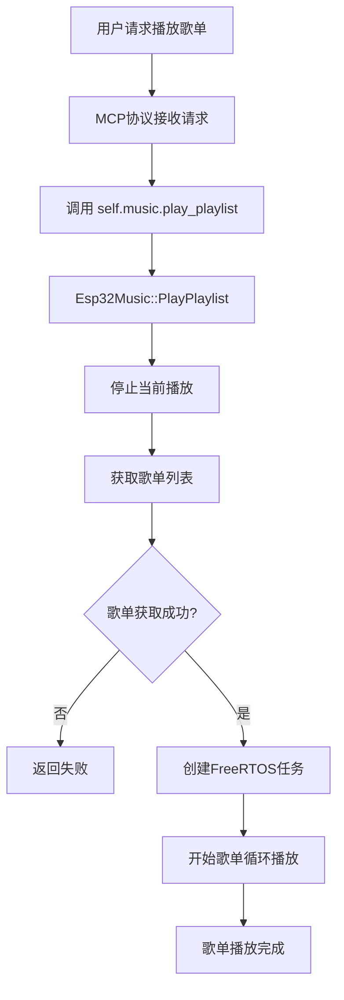
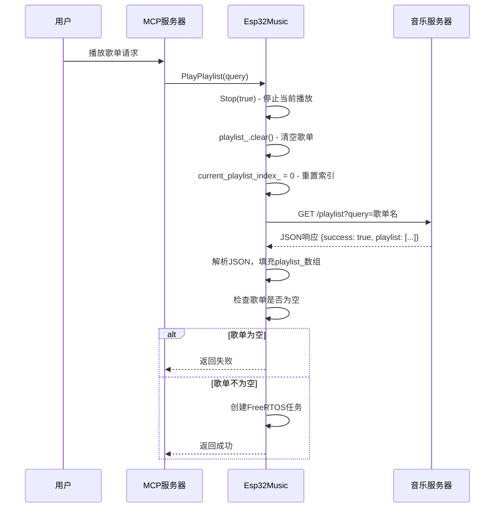
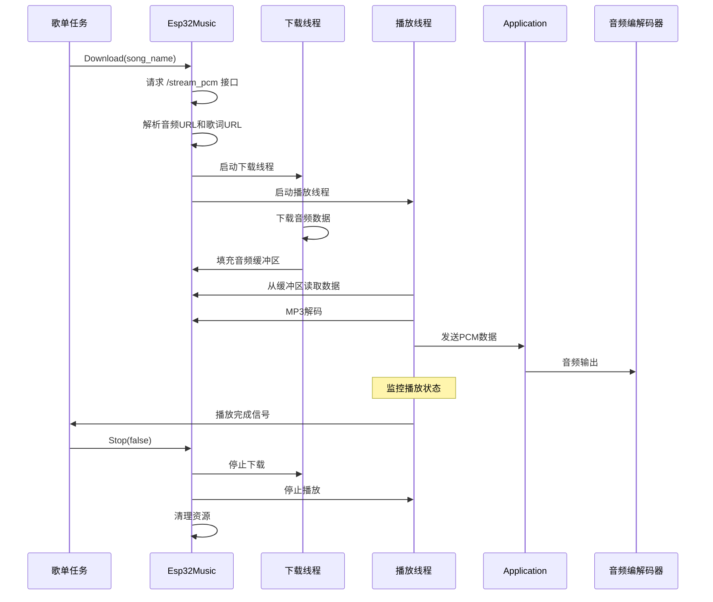
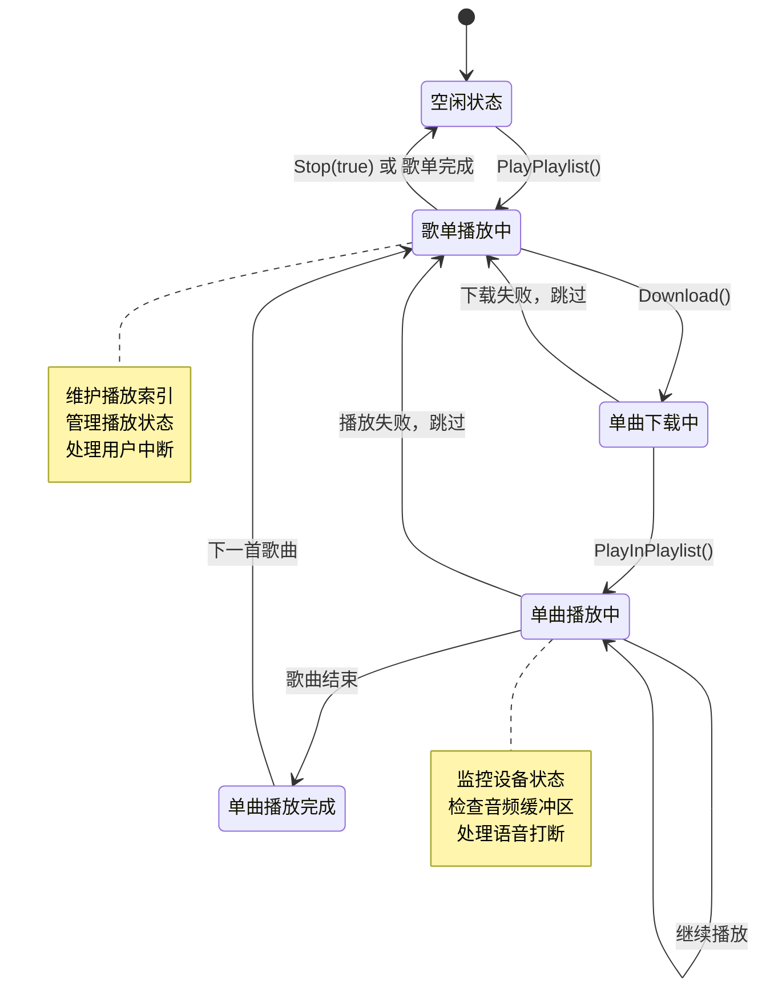

# 歌单播放流程图

## 整体架构图



## 详细流程图

### 1. 歌单获取流程



### 2. 歌单播放主循环

```mermaid
flowchart TD
    A[开始歌单播放任务] --> B[is_playing_ = true]
    B --> C{current_playlist_index_ < playlist_.size()?}
    C -->|否| D[歌单播放完成]
    C -->|是| E[获取当前歌曲名]
    E --> F[调用Download(song)]
    F --> G{下载成功?}
    G -->|否| H[++current_playlist_index_]
    H --> C
    G -->|是| I[调用PlayInPlaylist()]
    I --> J{播放启动成功?}
    J -->|否| H
    J -->|是| K[等待设备状态为Idle]
    K --> L[开始播放监控循环]
    L --> M{歌曲播放完成?}
    M -->|否| L
    M -->|是| N[调用Stop(false)]
    N --> O[CleanupAndReset()]
    O --> P[等待资源释放]
    P --> Q[++current_playlist_index_]
    Q --> C
```

### 3. 单首歌曲播放流程



### 4. 状态管理和错误处理



### 5. 资源管理流程

```mermaid
flowchart LR
    A[歌曲播放完成] --> B[Stop(false)]
    B --> C[停止下载线程]
    B --> D[停止播放线程]
    B --> E[清理MP3解码器]
    
    C --> F[CleanupAndReset]
    D --> F
    E --> F
    
    F --> G[清空音频缓冲区]
    F --> H[清理歌词数据]
    F --> I[释放内存]
    F --> J[等待TCP连接关闭]
    
    G --> K[准备下一首歌曲]
    H --> K
    I --> K
    J --> K
```

## 关键接口说明

### MCP协议接口
```json
{
  "method": "tools/call",
  "params": {
    "name": "self.music.play_playlist",
    "arguments": {
      "playlist_name": "流行金曲",
      "artist_name": "周杰伦"
    }
  }
}
```

### 服务器API接口
```
GET /playlist?query=歌单名或歌手名
Response: {
  "success": true,
  "playlist": ["歌曲1", "歌曲2", "歌曲3"]
}
```

### 音频流接口
```
GET /stream_pcm?song=歌曲名
Response: {
  "success": true,
  "audio_url": "/audio/xxx.mp3?token=xxx",
  "lyric_url": "/lyric/xxx.lrc?token=xxx"
}
```

## 性能优化点

1. **内存管理**：及时清理音频缓冲区和歌词数据
2. **TCP连接**：等待连接完全关闭，避免资源泄漏
3. **任务管理**：使用FreeRTOS任务替代pthread，更好的资源控制
4. **状态监控**：智能处理设备状态变化，避免不必要的停止
5. **错误恢复**：自动跳过失败的歌曲，保证歌单连续性

## 调试信息

关键日志标签：
- `[Playlist]`：歌单播放相关日志
- `Esp32Music`：音乐播放核心日志
- `MCP`：协议处理日志

重要调试信息：
- 歌单索引变化：`current_playlist_index_`
- 播放状态：`is_playing_`, `is_downloading_`
- 缓冲区状态：`buffer_size_`
- 设备状态：`DeviceState` 